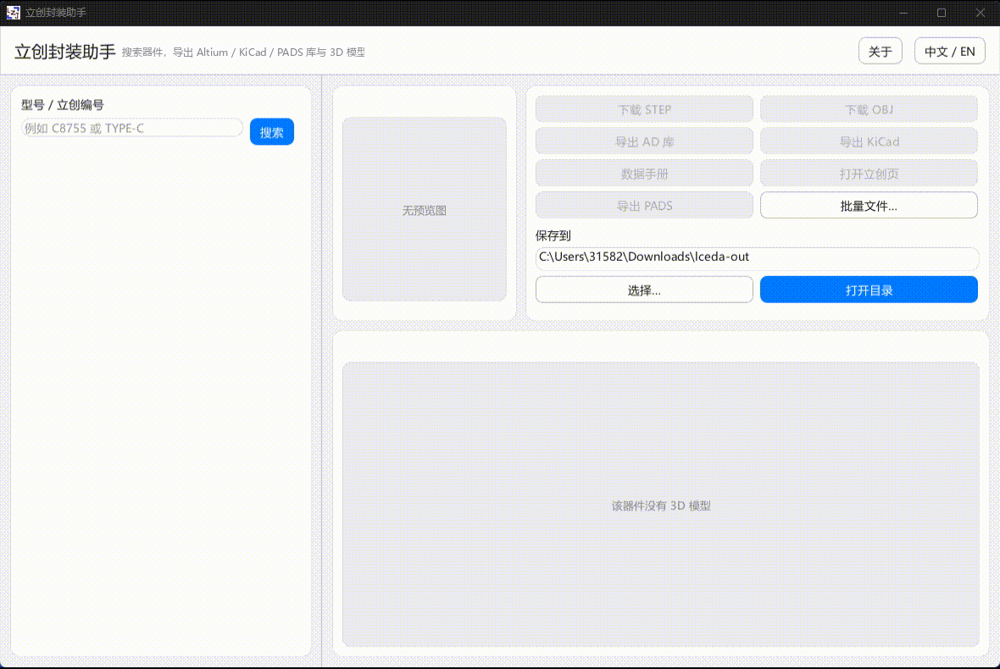

**语言 / Language:** **中文** · [English](README_EN.md)

# 立创封装助手

[](https://github.com/LZJ-I/lceda-assistant)

用 Rust 编写。按型号或立创编号搜索器件，下载 STEP / OBJ，导出 Altium（`.SchLib` / `.PcbLib`）、KiCad（`.kicad_sym` / `.pretty`）和经典 PADS Logic / Layout ASCII（`.c` / `.d` / `.p`）。界面支持中文 / 英文。

如果这个项目对你有帮助，欢迎点一下右上角的 [⭐ Star](https://github.com/LZJ-I/lceda-assistant)。



许可为 [CC BY-NC-4.0](https://creativecommons.org/licenses/by-nc/4.0/)，禁止商用。

## 安装

从 [Releases](https://github.com/LZJ-I/lceda-assistant/releases) 下载 Windows 64 位压缩包，解压后运行 `lceda.exe`。更新时解压覆盖即可。软件内也可检查更新并自动替换后重启。

或从源码编译（需 [Rust](https://rustup.rs/)）：

```bash
cargo build --release -p lceda --target x86_64-pc-windows-msvc
```

## 图形界面

双击 `lceda.exe` 打开。默认把文件保存到「下载」文件夹下的 `lceda-out`，可在右侧改路径，点「打开目录」查看。

每个器件一个子目录，名字是 `型号_立创编号_厂牌`，目录里的文件用型号命名。

1. 在搜索框输入型号（如 `STM32F103C8T6`）或立创编号（如 `C8734`），回车或点「搜索」。
2. 在左侧列表点选器件。右上是预览图，下半部分可拖动查看三维外形。
3. 用右侧按钮下载或导出：
   - **下载 STEP / OBJ**：三维模型
   - **导出 AD 库**：`.SchLib` / `.PcbLib`（同时保留 EasyEDA JSON）
   - **导出 KiCad**：`.kicad_sym` 与 `.pretty`
   - **导出 PADS**：`.c` 原理图 Decal、`.d` PCB Decal、`.p` Part Type（经典 Logic / Layout；Professional / Xpedition 不能当 Central Library）
   - **数据手册**：PDF。立创给的经常是 HTML 页，程序会从页面里取出真正的 PDF
   - **打开立创页**：国内站商品页（`item.szlcsc.com`）
   - **批量文件…**：先勾选要写出的类型，再选一个文本文件，每行一个编号或关键字

按钮变灰表示当前器件没有对应资源；再点一下会弹出说明，不会建空文件夹。

导出 AD / KiCad / PADS 时会同时留下 EasyEDA JSON，供对照，不必单独再导一遍。

### 批量文件

每行一个型号或立创编号，`#` 或 `//` 开头为注释。界面里点「批量文件…」会先弹出勾选框，可只导出其中几种（例如只要 PADS，或只要 AD）。

```
# 例子
C8734
STM32F030C8T6
C2040
```

## 命令行

无参数打开图形界面。

```bash
lceda search C2040
lceda get C2040 --step --ad --kicad --pads -o ./out
lceda get C2040 --source -o ./out
lceda get C2040 --datasheet -o ./out
lceda batch ids.txt --ad --kicad --pads --step -o ./out
lceda --lang en gui
```

`batch` 文本文件格式与上面相同；命令行用 `--ad` / `--kicad` / `--pads` 等开关选择类型。

## 说明

导出结果请在 Altium / KiCad / PADS 中核对后再使用。本工具使用立创非官方接口，可能随时变化。

## 关于

- 作者：[LZJ-I](https://github.com/LZJ-I)
- 仓库：[LZJ-I/lceda-assistant](https://github.com/LZJ-I/lceda-assistant)
- 许可：[CC BY-NC-4.0](https://creativecommons.org/licenses/by-nc/4.0/)（禁止商用）

有帮助的话，欢迎 [Star](https://github.com/LZJ-I/lceda-assistant)。
